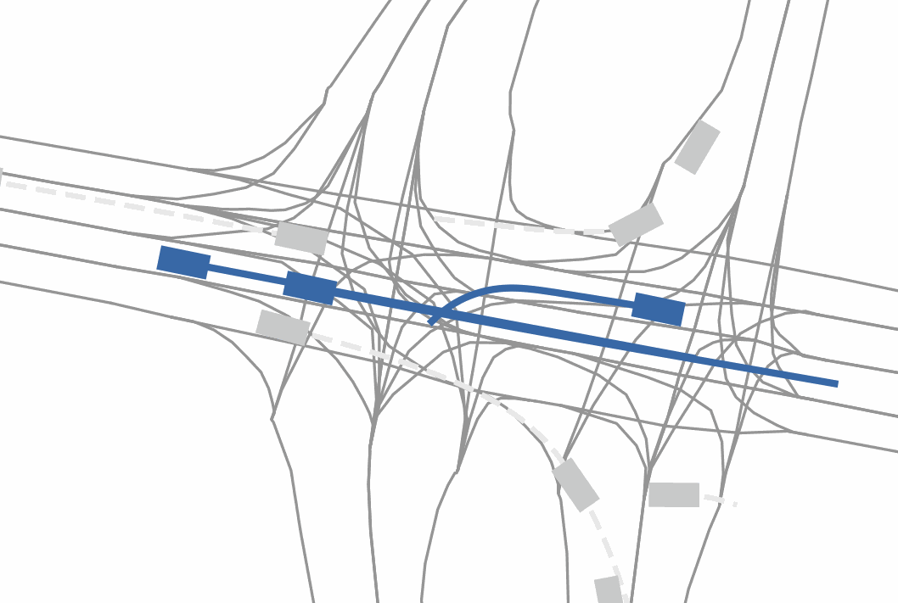
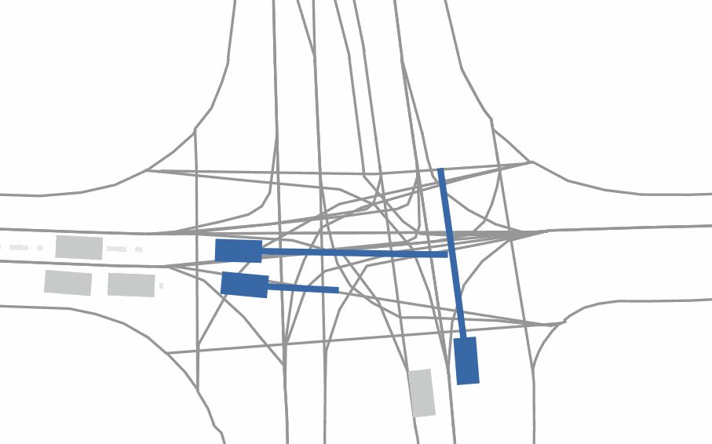
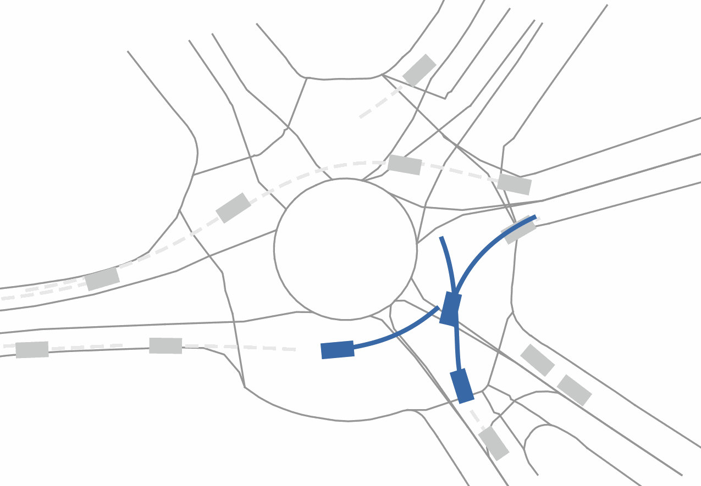
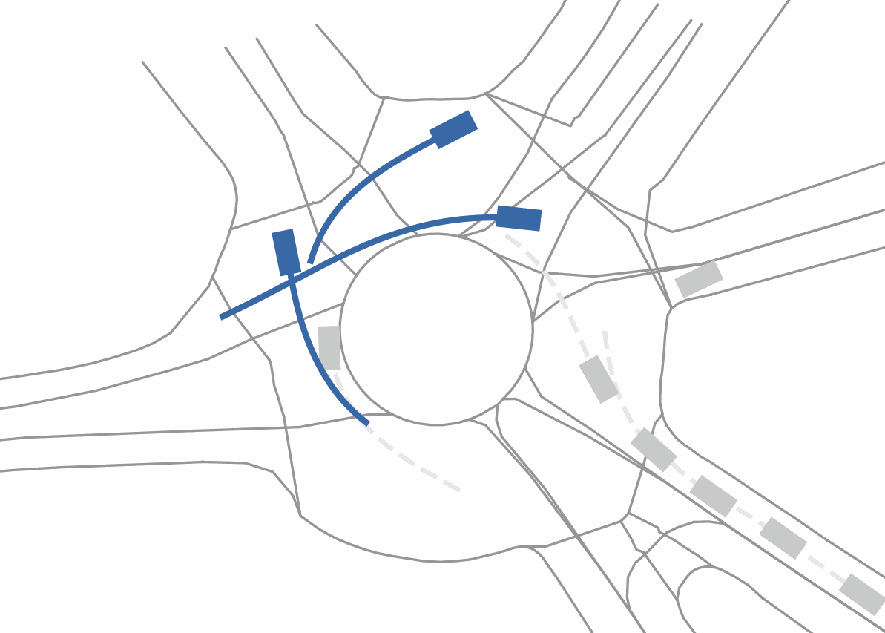
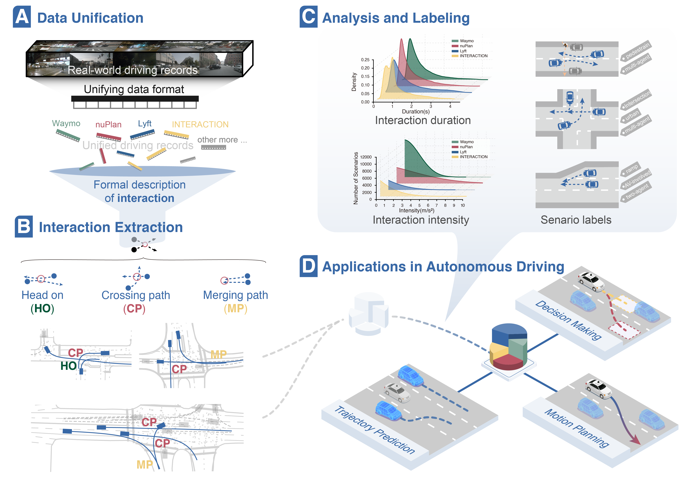

<p align="center">
    
    <h1 align="center">A Naturalistic Trajectory Dataset with Dense Interaction for Autonomous Driving</h1>

</p>


<br/>

> [**InterHub: A Naturalistic Trajectory Dataset with Dense Interaction for Autonomous Driving**](https://arxiv.org/xxxxx)  <br>
> [Xiyan Jiang](https://tops.tongji.edu.cn/info/1161/2143.htm)<sup>1</sup>, [Xiaocong Zhao](https://zxc-tju.github.io/)<sup>1,*</sup>, [Jian Sun](https://tops.tongji.edu.cn/info/1031/1187.htm)<sup>1</sup>, [Yiru Liu](https://tops.tongji.edu.cn/info/1131/1810.htm)<sup>1</sup>, [Zirui Li](https://lzrbit.github.io/)<sup>2</sup>, [Peng Hang](https://tops.tongji.edu.cn/info/1031/1383.htm)<sup>1</sup>, and Lu Xiong<sup>1</sup>  <br>
> <sup>1</sup> Tongji University, <sup>2</sup> Beijing Institute of Technology<br>
<sup> * </sup> Correspondance: zhaoxc@tongji.edu.cn


This repo is intended to serve as a starting point for driving-interaction-related research. We provide a publicly accessible dataset with rich interaction events and tools for interaction extraction.

<table align="center">
    <tr>
        <td></td>
        <td></td>
    </tr>
    <tr>
        <td></td>
        <td></td>
    </tr>
</table>
<br/>

## Roadmap

> Naturalistic driving datasets are reorganized using a unified data interface [trajdata](https://github.com/NVlabs/trajdata?tab=readme-ov-file#data-preprocessing-optional) to provide extensibility and easy access to multiple driving data resources. Then, driving interaction events covering a wide range of interaction archetypes, as well as their combinations, are extracted using the formal method. Rich features of the extracted scenarios, including interaction intensity, AV involvement, and conflict type, are analyzed and annotated to support applications with varied needs regarding driving interaction data.

<div align="center">

</div>

## Overview

We offer three tools to help users navigate **InterHub**:

* **0_data_unify.py** converts various data resources into a unified format for seamless interaction event extraction.

* **1_interaction_extract.py** extracts interactive segments from unified driving records.

* **2_case_visualize.py** creates GIFs to visualize interaction cases in **InterHub**, showcasing typical scenarios.


## Quick Start

### Environment Setup

Ensure the following prerequisites are satisfied. We recommend using conda for Python environment management.

* Create and activate a conda environment:
  ```bash
  conda create --name interhub python=3.8
  conda activate interhub
  ```

* Upgrade pip to the latest version:
  ```bash
  python -m pip install --upgrade pip
  ```

* (Optional) Change pip source for faster installation if encountering network issues:
  ```bash
  pip config set global.index-url https://mirrors.tuna.tsinghua.edu.cn/pypi/web/simple
  ```

* Install required packages:
  ```bash
  pip install -r requirements.txt
  ```

### Walk through InterHub with a Mini Dataset

* A subset of the original *interaction_multi* dataset is provided in `data/0_origin_datasets/interaction_multi` for a quick try. Unify the data with:
  ```bash
  python 0_data_unify.py --desired_data interaction_multi --cache_location data/1_unified_cache/interaction_multi --data_dirs data/0_origin_datasets/interaction_multi
  ```

* Extract interaction events from the subset:
  ```bash
  python 1_Interaction_extract.py --desired_data interaction_multi --cache_location data/1_unified_cache/interaction_multi --save_path data/2_extracted_results
  ```

* Visualize the interaction events:
  ```bash
  python 2_case_visualize.py --cache_location data/1_unified_cache/interaction_multi --interaction_idx_info data/2_extracted_results/results.csv --top_n 3
  ```
  See `figs/case` for visualization results.

## Full Working Flows with InterHub

### 1. Data Unification

**1.1 For ready-to-use interaction data in InterHub**, download and use the data from [InterHub](https://lianjie.link/interhub), unzip it, and place it in the `data/1_unified_cache` folder. Proceed to [2. Interaction Event Extract](#2-interaction-event-extract).

**1.2 For working from scratch or extracting from other data resources**, the origin datasets are necessary. Refer to [Datasets](#datasets) for details on building the needed dataset structure. Preprocess the dataset to form a data cache if using initial or unprocessed datasets.

For datasets including **INTERACTION, nuPlan, Waymo, lyft**, `1_Data_unify.py` provides scripts for preprocessing raw data into a unified data cache. The project [trajdata](https://github.com/NVlabs/trajdata?tab=readme-ov-file#data-preprocessing-optional) is used in this step. Replace arguments according to the dataset you want to process:

- **desired_data**: List of datasets to process, e.g., `["interaction_multi"]`. See support list in [dataset.md](dataset.md).

- **load_path**: Path where raw data is stored, e.g., `'data/0_origin_datasets/interaction_multi'`.

- **cache_location**: Path where the generated cache will be stored. Ensure enough memory, e.g., `'data/1_unified_cache/interaction_multi'`.
---

### 2. Interaction Event Extraction

```bash
python 2_Interaction_extract.py \
--desired_data dataset_name \
--cache_location path/to/your/dataset/cache \
--save_path path/to/save/your/result \
--timerange=5
```

Replace `cache_location` and `save_path` with your paths. For details, refer to the parameter settings in the [Get trajdata cache](#get-trajdata-cache) section. By default, a subset of `interaction_multi` dataset is read from the `data/1_unified_cache` folder.

---

### 3. Visualization

#### Case visualization
Run `2_case_visualize.py` to plot interaction segments and generate GIFs.

#### Paper plot
Run `3_paper_plot.py` to plot results in the paper using metadata of interaction events in the full InterHub dataset.

---

## Citation
If you find this repository useful for your research, please consider giving us a star 🌟 and citing our paper.


